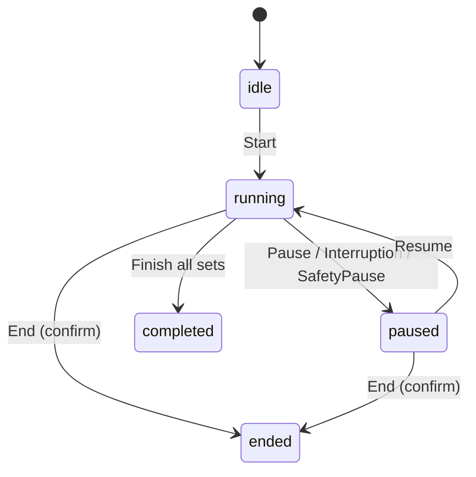

# Interfit — 产品设计文档（Phase1–Phase4 整合版）

> 目标：将 `design_phase_1.md` 到 `design_phase_4.md` 的内容**有逻辑地整合**为一份前后一致、可落地的完整设计文档。本文以 Phase4 的设计原则与默认护栏为最终口径，吸收 Phase1 的功能基线，并融合 Phase2/3 的关键工程现实约束、稳定性与一致性治理。

## 0. 文档信息

- **版本**: v1.1（Phase1–Phase4 Integrated）
- **范围**: 产品功能与交互规范 + 概念级技术方案（不含高保真视觉、不含服务端具体实现细节）
- **核心承诺**: **先开练，音乐可选；计时与段切换永远可用；基础训练工具完全免费且不需要登录**
- **商业化口径**: 内容市场“免费/付费混搭”，平台对创作者收入抽取 **30%** 服务费，剩余 **70%** 结算给创作者
- **本次更新（v1.1）**: 补齐“免费工具层 + 内容市场 + 登录门槛 + 30% 分成”的产品规则、创作者/消费者流程与概念级数据模型

## 1. 产品概述

### 1.1 一句话

Interfit 是一款 iOS 间歇训练应用：用户可配置“运动/休息”的节奏，并为运动段与休息段设置不同音乐；在训练中零操作自动切段与切歌。基础训练工具完全免费且不需要登录；同时提供“内容市场”（免费/付费混搭），让高质量训练方案可被发现、预览、购买与一键应用。

### 1.2 核心价值与原则

- **训练节拍优先**：计时与段切换是核心，音乐是增强；任何异常必须优先保证节拍可理解、可恢复。
- **先转化后授权**：首启不强弹音乐/通知权限，允许无授权在 30 秒内完成一次开练。
- **工具层永久免费**：计时器、音乐切换逻辑、本地保存与开练能力**全部免费**，作为长期留存的“基础设施”。
- **登录只服务于交易与社区身份**：不让“想开练”被登录阻塞；登录仅用于评论/点赞/购买/发布/跨设备等需要身份的行为。
- **可解释降级**：音乐不可用/弱网/系统中断不可避免，必须保证“不中断训练”，并解释发生了什么。
- **默认保守、避免惊吓**：来电/闹钟/耳机断连切外放等高风险场景默认自动暂停训练，等待用户显式继续。
- **发现可控、零压力**：发现与复盘提供轻量正反馈，不做压力化排行/羞辱式提醒；社区信息量可被筛选收敛。
- **数据可信**：训练 Session 与社交 Post 绑定不可变版本/快照；“一键应用”语义为复制（fork），默认不跟随更新。

## 2. 用户画像与使用场景

### 2.1 目标用户（Primary）

- **节奏训练爱好者**：HIIT/Tabata/间歇跑/跳绳等，需要清晰的 Work/Rest 切换与提示。
- **音乐驱动型训练者**：训练动力依赖音乐，希望 Work/Rest 自动切换不同音乐/风格。
- **复用模板用户**：经常重复固定训练，希望一键开始、少配置。

### 2.2 次要用户（Secondary）

- **新手入门**：需要内置模板、合理默认值、参数解释与安全边界。
- **社交型健身用户**：愿意分享/讨论训练设置，浏览他人方案并一键套用。

### 2.3 典型场景

- **室内训练**：手机在口袋/支架，主要依赖耳机与锁屏控制。
- **户外训练**：更依赖语音/震动提示，屏幕交互要极简，需规避外放爆音。
- **碎片化训练**：10–20 分钟快速开练，结束后只要简洁总结与复用入口。

### 2.4 Jobs To Be Done（JTBD）

- 我想要训练时按固定节奏自动切换运动/休息，**这样我能**专注动作而不是盯计时器。
- 我想要运动段与休息段自动播放不同音乐，**这样我能**更顺滑地进入/退出强度状态。
- 我想要保存并复用（或一键套用他人分享的）训练设置，**这样我能**更快开始并持续迭代。

## 3. 核心概念与术语（统一口径）

### 3.1 训练与计划

- **Segment（段）**：Set 内的时间片，类型为 `Work` 或 `Rest`。
- **Set / Cycle（组）**：训练重复的单位，一组通常包含 Work + Rest（Phase1–4 均以此为默认结构）。
- **Workout Plan / Plan（计划）**：可复用配置对象（用户资产），可编辑。
- **Session（训练会话）**：一次实际执行记录（开始→结束），全程绑定不可变快照。

### 3.2 音乐

- **MusicSelection（音乐引用）**：对某段要播放内容的引用（来源、类型、外部 id、展示信息、播放模式）。
- **Playback Mode（播放模式）**：
  - `continue`（默认）：跨段连续播放更“顺”
  - `restart_on_segment`：进入段时从头播
  - `shuffle_on_segment`：进入段时随机起播（若来源支持）

### 3.3 社交

- **Post（帖子）**：公开发布的内容单元，引用不可变的计划版本/快照。
- **Apply（应用）**：将 Post 的计划版本**复制**到“我的计划库”，形成新的 Plan（fork）。

### 3.4 版本与快照（稳定性核心）

- **PlanVersion（计划版本）**：不可变版本记录（draft/published）。
- **PlanSnapshot（训练快照）**：Session 开始时固化的不可变快照；Session 全程使用同一份快照。
- **核心规则**：
  - **发布后版本不可编辑**，只能发布新版本
  - **Apply = fork**，默认不跟随源作者更新
  - **训练中改动不暗改计划**：训练中调整写入 SessionOverrides，用户显式保存才影响计划/下次训练

## 4. 信息架构（IA）与关键入口

### 4.1 建议 IA（底部 Tab）

- **训练（Train）**：快速开练、继续未完成 Session、最近计划
- **计划（Plans）**：我的计划库、创建/编辑、版本/来源追溯
- **社区/市场（Community/Market）**：搜索/筛选、方案预览与购买、帖子详情、评论、一键应用
- **我的（Me）**：设置（提示/播放与中断/隐私）、备份与跨设备、账号与创作者中心、黑名单/举报、订单与已购

### 4.2 训练时入口优先级

- **一键开始**：默认走“提示音模式/已配置计划”开练，不阻塞权限
- **恢复会话**：异常中断/崩溃后可继续或结束（可解释）
- **暂停/继续**：最大触控区域
- **结束/跳过**：强误触保护（确认或长按）

## 5. 核心流程（可落地口径）

### 5.1 首启与“30 秒开练”（无授权也能完成）

原则：**首启不弹音乐/通知权限，不要求登录**。

推荐首启三入口：

- `快速开练`（主入口）
- `选择模板`（内置模板）
- `从社区应用`（可选：首启可放二级，避免噪声）

黄金路径（目标 3 步进入 running）：

1. 点 `快速开练`
2. 选择预设（例如 20 分钟 10 组 90/30）或强度档（轻/中/强）
3. 直接进入训练（默认 **震动 + 提示音** 的提示音模式）

训练页顶部轻提示：

- “当前为提示音模式：随时可添加音乐（建议在休息段设置）”

#### 5.1.1 内置模板（首启与回访默认供给）

原则：覆盖常见场景、名称直观、参数合理、避免过长；模板卡片统一展示摘要 `((work+rest)×sets = total)`。

建议内置 3–5 个：

- **HIIT 入门（20:00）**：10 组，90s/30s
- **Tabata 标准（08:00）**：8 组，20s/10s
- **跑步间歇（30:00）**：10 组，2:00/1:00
- **力量组间休息（25:00）**：10 组，2:00/0:30
- **拉伸/恢复（12:00）**：6 组，1:30/0:30

### 5.2 音乐权限（与 Apple Music 订阅提示）（延后申请，不阻塞训练）

仅在用户表达意图时请求音乐权限：

- 训练页点击 `添加音乐`
- 计划编辑页进入 `选择音乐`
- 模板详情点击 `为本计划设置音乐`

权限弹窗前必须先展示 1 屏收益解释：

- “让每段训练自动切歌（Work/Rest 可不同）”
- 按钮：`继续并允许` / `先不需要`

用户点 `先不需要`：

- 本次训练不再强提示
- 仅在用户再次主动点击时再出现解释页

#### 5.2.1 权限与可用性状态机（MVP 必须可解释）

- **Not Determined**：不在冷启动第一屏强弹；在用户首次进入“选择音乐/添加音乐”意图点触发解释页后再请求
- **Authorized**：可读取/播放授权范围内容；若 Apple Music 目录需要订阅，必须给出替代路径（本地库/提示音模式）
- **Denied/Restricted**：选择器仅提供提示音模式/去设置开启权限入口；不阻塞训练

> 文案护栏：避免“受限/失败”语气，使用“提示音模式/专注模式”等中性表达。

### 5.3 计划创建/编辑（MVP 参数与校验）

#### 5.3.1 最小参数集（标准化落地）

- `setsCount`（组数）
- `workSeconds`（运动段时长）
- `restSeconds`（休息段时长，可为 0）
- `musicConfig`（音乐策略与引用，允许为空以走提示音模式）

总时长：

\[
total = (workSeconds + restSeconds) \times setsCount
\]

#### 5.3.2 输入模式（同一结果多入口）

- **模式 A（默认）**：组数 + 每组 work/rest
- **模式 B（进阶）**：总时长 + 组数 + work:rest 比例 → 计算出 work/rest 并可微调

#### 5.3.3 默认值与边界（建议）

- `setsCount`：1–99（默认 10）
- `workSeconds`：10–1800（默认 90）
- `restSeconds`：0–1800（默认 30）
- 总时长软上限：2 小时（超过提示但允许）

#### 5.3.4 创建交互（低摩擦）

- 步进器（±1s/±5s）+ 长按加速 + 直接输入
- 实时预览卡片：`(work+rest)×sets = total` + （可选）预计结束时间
- 可选“强度预设（轻/中/强）”一键填充比例（不引入新必填项）

### 5.4 音乐配置（统一为三种策略，解决“每组不同但不高成本”）

#### 5.4.1 策略定义

- **Global（默认）**：全程复用一对 Work/Rest selection
- **Cycle（MVP 必须）**：Work 与 Rest 各维护一个列表 `sequence[]`，第 i 组取 `i % n`
- **Explicit（高级）**：逐组覆盖；若做必须提供批量操作（否则建议 Phase2+）

#### 5.4.1.1 MusicSelection（概念级字段，口径统一）

每个 selection 至少包含：

- `source`: `apple_music | local_library | none`
- `type`: `track | playlist | album | station`（MVP 可先实现 track/playlist，其他占位）
- `externalId`: string
- `displayTitle`, `artworkUrl?`（仅用于展示，不参与等价判定）
- `playMode`: `continue | restart_on_segment | shuffle_on_segment`

默认 `playMode=continue`；同一 selection 等价时**不打断**播放，减少割裂感。

#### 5.4.2 selection 等价判定（减少误切歌）

判定等价（不重建队列）的条件：

- `source/type/externalId/playMode` 全相同
- `displayTitle/artwork` 不参与判定

#### 5.4.3 切段切歌与失败回退（保证不中断）

- 同一 selection：不打断播放，仅更新 UI
- 不同 selection：段边界切换；建议 0.5–1.0s crossfade（MVP 可降级为直接切换）
- 提示音需 duck（短暂压低音乐音量）以可感知
- 下一段加载失败：
  - **优先继续当前音乐**，同时提示“下一段音乐不可用，已继续播放/已降级提示音”
  - 必要时进入提示音/静音 fallback，但不阻塞训练

#### 5.4.4 音乐选择器（Picker）交互（MVP）

- 入口：计划编辑页的“运动音乐/休息音乐”字段；训练中（休息段）可从 `添加音乐` 进入
- 选择器内容：
  - 搜索（名称）
  - 最近使用（最多 10 条）
  - 我的歌单/专辑（按平台能力）
- 选择完成后返回，字段展示：封面 + 名称 + playMode 简写

降级：

- 无权限/不可用：选择器空态直接给出 `使用提示音模式（推荐）` + `去设置开启权限`

### 5.5 训练执行（Session）

#### 5.5.1 状态机（MVP）

- `idle` → `running` → `paused` → `completed | ended`



#### 5.5.2 计时模型（避免漂移）

- 以绝对时间戳计算剩余时间（不靠每秒递减累积）
- UI 刷新与计时解耦：前台 0.25–1s 刷新；后台尽量只在段切换/暂停/继续时更新

#### 5.5.3 训练主屏信息层级

优先级：**当前段** > **剩余时间** > **当前组/总组** > **下一段预览** > **音乐信息**。

默认启用极简布局：只显示段+大计时+暂停/继续；其余折叠到可展开区域。

#### 5.5.3.1 训练主屏建议元素（MVP）

- Segment Banner：Work/Rest（文字 + 颜色/形状双编码，避免仅靠颜色）
- Big Timer：当前段剩余时间（动态字体适配）
- Set Progress：`Set i / N`（可选环形进度）
- Next Preview（可选，默认折叠）：下一段类型 + 时长
- Now Playing（轻量，默认折叠）：当前播放名称/状态
- Controls：
  - 主按钮：Pause/Resume
  - 次按钮：End（二次确认）
  - 可选：Skip（默认隐藏或长按 1s）

#### 5.5.4 提示（Cue）通道与默认

默认建议（可在设置中改）：

- 震动：开（若支持）
- 提示音：开（短 beep）
- 语音播报：关（用户显式开启）
- 视觉反馈：开（轻量，不刺眼）

#### 5.5.5 高风险场景：中断与路由切换（默认保守）

默认策略矩阵摘要：

- 来电/闹钟：**自动暂停训练**（不自动恢复）
- Siri 短提示：≤3 秒不暂停；>3 秒暂停（阈值可配）
- 耳机断连导致可能外放：**安全暂停**（避免爆音），提示用户显式继续

训练页/锁屏需要明确展示 `Paused` 原因与 `继续` CTA。

#### 5.5.5.1 默认策略矩阵（摘要可直接落地）

| 场景 | 默认对训练计时 | 默认对播放 | 恢复 |
| --- | --- | --- | --- |
| 来电/FaceTime | **立即暂停** | 系统接管 | 结束后显示“继续训练”，不自动恢复 |
| 闹钟/计时器响铃 | **立即暂停** | 系统响铃不可控 | 响铃结束后显示“继续训练” |
| Siri 短提示 | ≤3 秒保持 running；>3 秒暂停 | duck/短中断 | 回到 App 给轻提示 |
| 耳机→扬声器/车载外放 | **安全暂停**（避免外放惊吓） | 暂停 | 用户显式继续后再外放 |
| 其他 App 接管播放 | 训练保持 running（优先） | 可能被替换 | 提示“音乐被接管”，允许一键恢复 |

默认开关（设置 → 播放与中断）：

- 来电/闹钟自动暂停训练：开
- Siri 暂停阈值：3 秒
- 耳机断开安全暂停：开
- 播放不可用时使用替代提示（震动/提示音）：开
- 训练暂停后自动恢复播放：关

### 5.6 训练中快速改动（Override 层，不暗改计划）

规则：

- Session 使用 PlanSnapshot 固定不变
- 训练中改动写入 `SessionOverrides`
- 仅当用户显式选择“保存到计划/保存为新计划”才把 overrides 吸收到 Plan 的 draft

改动分级：

- **低风险（播放/提示）**：本次 Session 立即生效（默认不写回）
- **中风险（时间微调）**：允许“延长当前 rest +15/+30/+60”“提前结束 rest”，标记“已临时调整”
- **高风险（结构）**：默认不在训练中改组数/基础时长；如提供必须显式确认并清楚标注作用范围

训练结束页折叠展示“本次临时调整”，提供：

- `保存为新计划` / `更新到当前计划草稿` / `不保存（默认）`

### 5.7 训练结束总结（零压力）

展示：

- 完成状态：已完成 / 提前结束（中性表达）
- 用时（elapsed/active 可选）
- 完成组数/总组数
- 关键事件标签：播放降级/发生中断并恢复/临时调整

主要 CTA：

- `再来一次`
- `保存到计划库`
- `发布到社区（可选）`

首次完成后温和引导：

- “下次想要自动切歌吗？” → `连接 Apple Music` / `保持提示音模式`
- 明确承诺：“不连接也能照常使用”

## 6. 我的计划库（复用优先，防膨胀）

### 6.1 三列表（默认足够）

- 最近使用（首页默认）
- 收藏
- 全部
- 可选：归档（库膨胀安全阀）

### 6.2 计划卡片字段（10 秒可决策）

- 标题 + 场景标签
- 参数摘要：`20分钟 · 10组 · 90/30`
- 音乐状态：`音乐已配置 / 提示音模式 / 未设置`
- 来源与版本：`来源 @作者·vN`、`有未发布更改`
- 主 CTA：立即开练

### 6.3 Apply 去重（避免库被重复计划淹没）

若已存在同源版本（`forkedFromVersionRef` 或 `contentHash` 相同）：

- 提示“你已经应用过这个版本”
- 默认建议：`打开已有计划`，可选 `复制一份`

## 7. 社区（发现可控 + 最小治理闭环）

### 7.1 Post 内容字段（MVP）

- 标题、作者、创建时间
- 配置摘要（组数/work/rest/总时长/标签）
- 定价信息：`免费` / `付费`（若付费展示价格档位）
- 质量信号：apply/save/comment/like
- CTA：一键应用 / 立即开练（提示音模式也可）

### 7.2 发现策略：搜索/筛选优先于无限刷

默认进入“可收敛的发现页”：

- 搜索框
- 筛选 chips（时长桶、组数桶、比例、场景标签、可无授权使用）
- 价格筛选（免费/付费/已购）
- 结果列表分页/有限滚动

排序：质量信号 + 时间衰减（可运营权重），并与举报/风控负向信号联动降权。

排序最小可行（概念级示例，便于服务端首版实现）：

- `score = apply*3 + save*2 + comment*1 + like*0.5`
- 再乘以时间衰减因子（按天/小时）

### 7.3 Apply（复制语义，防信任崩塌）

一键应用必须明确：

- “已复制到你的计划库：后续修改互不影响（不会自动跟随原作者更新）”

### 7.4 治理（最小闭环）

MVP 必须具备：

- 举报入口（Post/Comment/User）+ 提交回执 + 设置里可查看状态（received/处理中/已处理）
- 拉黑（Block）服务端强一致：Feed/详情/评论/通知四处都生效
- 限流：发帖/评论/互动的频控与可解释冷却提示
- 内容去重：同用户同 contentHash 的重复发布拦截

### 7.5 发布（作者工具最小集，提升内容质量）

入口：计划详情/训练结束页 → `发布到社区`。

发布 3 步（不做重表单）：

1. 选择发布版本（从当前草稿生成新的 published version；提示“发布后固定不可编辑”）
2. 变更说明（可选但推荐）：提供 chips（更适合初学者/更高强度/更长休息/改进音乐切换…）+ 1 行文本
3. 发布设置：可见性（公开/仅自己）+ 评论开关（默认开）+ 商业化（免费分享/设置价格档位）

评论管理（作者侧最小控制）：

- 关闭/开启评论
- 删除恶意评论（确认）
- 拉黑/举报（走治理体系）

### 7.6 内容市场与商业化（免费/付费混搭）

本节定义：**基础工具层永久免费**；在不牺牲“随时可开练”的前提下，引入“训练方案内容市场”作为商业化与增长飞轮。

#### 7.6.1 访问与登录门槛（默认护栏）

- **无需登录即可**：
  - 浏览列表（Feed/Search/筛选）
  - 进入方案详情的**摘要态**（展示标题、作者、摘要参数、标签、示例/节选、口碑信号）
  - 对**免费方案**执行 `立即开练（提示音模式）`（不把“开始训练”绑定到账号）
  - 对**免费方案**执行 `应用到计划库（匿名/本地）`（不登录也能把方案留在手机里）
- **需要登录才可**（身份/交易/反作弊需要）：
  - 查看方案详情的**完整预览**（完整配置、完整音乐引用列表、作者详细说明/注意事项）
  - 发表评论、点赞、收藏、关注
  - 将“匿名/本地应用”的计划**同步到账号/跨设备**（含互动计数、反刷）
  - 下载/导出（若提供文件/外部分享载体）与已购恢复
  - 购买付费方案、查看已购与订单、申请退款/问题反馈
  - 发布方案（创作者中心）、设置价格、查看收入与结算

> 解释口径：不登录也能训练；登录是为了“身份与资产”（社区互动、已购权益、跨设备）。

#### 7.6.2 商品形态与解锁单位

- **售卖对象**：`PlanVersion (published)` 的“内容授权（Entitlement）”，用户购买后获得：
  - 该版本的完整配置（含音乐引用、节奏与说明）
  - `应用到计划库（fork）` 权限（复制一份到本地/账户资产）
  - 后续同版本重复下载/应用免再次付费
- **不售卖**：计时器、段切换、音乐切换逻辑、本地计划创建/保存（永久免费）

#### 7.6.3 定价策略（低决策成本，小额档位）

- 建议提供**固定档位**（平台可配置）：例如 **¥1 / ¥6 / ¥12**（可扩展）
- 规则：
  - 创作者只能在档位中选择（减少价格噪声与纠纷）
  - 付费方案必须提供免费预览态（参数摘要 + 示例段落 + 适用人群/风险提示）
  - 价格调整需要发布新版本（版本不可变原则一致）

#### 7.6.4 创作者流程（需要登录）

在 `发布到社区` 的第 3 步（发布设置）中新增“商业化”选择：

- `免费分享`：
  - 直接发布，所有用户可浏览；登录用户可 Apply/互动
  - 用于积累人气/粉丝/口碑
- `设置价格`：
  - 选择价格档位（如 ¥1/¥6/¥12）
  - 发布后该版本进入“付费方案”状态
  - 展示“购买后解锁：下载/应用/完整配置”

创作者中心（Me → 账号与创作者中心）最小能力：

- 方案列表：免费/付费、销量、收入、退款数（聚合）
- 收入概览：可结算金额、已结算金额、结算中
- 结算说明：平台服务费 30% 的口径与规则（见 7.6.6）

#### 7.6.5 消费者流程（小白/想省事的人）

- 浏览到方案卡片：
  - 免费方案：`摘要态` → `匿名应用到计划库（本地）` 或 `立即开练`
  - 付费方案：`摘要态` → `购买解锁（需登录）` → `应用到计划库（fork）`
- 购买后：
  - 详情页状态变为 `已购买`，提供 `应用到计划库（fork）` 与 `立即开练`
  - 离线可用：已购权益本地缓存（需有恢复机制，见 12.x）

#### 7.6.6 分成与平台收入（你的利润来源）

- **分成规则**：平台抽取 **30%** 服务费，剩余 **70%** 结算给创作者。
- **结算口径（概念级）**：
  - 以订单“可结算净额”为基数进行分成（需覆盖支付渠道成本、税费与退款冲回）
  - 退款/撤销：对应订单在结算侧回滚（若已结算则下一期冲抵）
- **展示口径**：
  - 用户侧：显示方案售价（¥1/¥6/¥12）
  - 创作者侧：显示该方案的“预计到手/平台服务费”拆分（可选开关，默认简洁）

## 8. 训练历史与复盘（零压力）

### 8.1 最近训练列表（默认）

每条展示：时间、计划名与摘要、状态（完成/提前结束）、事件标签（降级/中断/临时调整）。

操作：再次开练、详情。

### 8.2 Session 详情（追溯优先）

- 来源追溯：来自哪个计划/版本（草稿 or 发布 vN）
- 本次关键事件：播放降级原因分类、音频中断/路由变化、临时调整列表
- 仅 1 条可行动建议（避免压迫）

默认不展示：连续天数、排行榜、羞辱式提醒。

## 9. 设置系统（分层、默认护栏、可解释）

三层模型与优先级（从高到低）：

1. SessionOverrides（本次训练临时）
2. Plan Settings（计划内）
3. Global Settings（全局默认）
4. 系统约束（静音、后台限制等）

建议默认：

- 震动：开
- 提示音：开
- 语音播报：关
- 极简模式：开
- 耳机断开安全暂停：开
- 训练暂停后自动恢复播放：关（避免“用户没准备好就响”）

## 10. 备份与跨设备（本地优先 + 可选 iCloud/账号同步）

### 10.1 最小承诺

- 默认本地完整可用，不登录也能用
- 备份/同步失败不阻塞开练
- 同步/备份只同步“计划/历史/设置”等用户资产；音乐只同步引用，不承诺新设备必可播放

### 10.2 三档模式（渐进）

- 本地（默认）
- iCloud 备份（推荐：换机可恢复，不承诺实时同步）
- 账号同步（可选增强：多设备更一致，仍坚持本地优先）

提供最小灾备：手动导出/导入（备份文件 JSON/zip+json，含 schemaVersion，不含音频本体）。

## 11. 通知与系统集成（不打扰前提下提升完成率）

红线：

- 首启不弹通知权限
- 默认 0 通知
- 只服务于用户明确意图（用户开启提醒/社交通知/可靠性提醒时才申请权限）

通知类型（可选）：

- 训练提醒（本地通知，一键开练深链）
- 社交通知（默认关，合并推送、限流、尊重专注模式）
- 可靠性提醒（仅当用户启用备份/同步后可选）

系统集成（概念级）：

- 锁屏/后台显示与控制（暂停/继续为主）
- Live Activity（可开关）
- 小组件：一键开练
- Shortcuts：开始快速开练/开始某计划/提示音模式开始
- Apple Watch：远程控制 + 触觉提示（非首发承诺）

## 12. 技术方案（概念级）

### 12.1 数据模型（概念级，字段口径一致）

- `User`（账号体系：用于互动/购买/发布/跨设备；不阻塞基础训练）
- `Plan`（可编辑）
- `PlanVersion`（draft/published，不可变）
- `PlanSnapshot`（Session 启动时固化，不可变）
- `Session`（含 status、completedSets、pauseTotalSeconds、关键事件标签）
- `SessionOverrides`（训练中临时调整）
- `MusicSelection`（source/type/externalId/playMode/display）
- `Post`（引用 published version 或其 snapshot/hash）
- `Comment`、`Interaction`（like/save/apply）
- `Report`、`BlockList`（治理闭环）
- `ProductSKU`（价格档位与可售卖项：PlanVersion 绑定 + priceTier）
- `Order` / `Purchase`（订单与购买记录：userId、sku、amount、status、refund）
- `Entitlement`（已购权益：userId ⇄ planVersionRef，解锁 Apply/下载/完整配置）
- `CreatorProfile`（创作者身份与展示信息）
- `PayoutLedger`（结算台账：gross、fees、platformServiceFee30%、netToCreator）

#### 12.1.1 不可变关系图（口径统一）

```mermaid
flowchart LR
  Plan[Plan 可编辑] --> Draft[PlanVersion: draft]
  Plan --> Pub[PlanVersion: published]
  Draft -->|开始训练| Snap[PlanSnapshot 不可变]
  Pub -->|发布| Post[Post 引用 published version/snapshot]
  Post -->|Apply=Fork| Plan2[新 Plan (fork)]
```

### 12.2 configVersion 与迁移

- `configVersion` 随结构变更递增
- 维护迁移链（纯函数、幂等、copy-on-write）
- Apply 时先迁移 snapshot 再生成新 plan

### 12.3 播放与计时引擎关键点

- 计时以绝对时间推导，减少漂移
- selection 等价判定避免误切歌
- 失败回退：优先不中断训练与节拍；必要时切到提示音/震动

### 12.4 离线/弱网与不可用原因分类

原因分类用于可解释提示：

- 权限/账户（未授权、订阅不可用）
- 资源（下架/地区限制）
- 网络/服务（弱网/超时）
- 播放竞争（其他 app 接管）

策略：开练前轻量预检（超时则降级不阻塞）+ 训练中 fallback（最多快速重试 1–2 次）。

#### 12.4.1 静音模式后台限制（必须写进产品承诺）

iOS 对后台执行有限制：在不持续输出音频的情况下，不承诺“锁屏/切后台仍可持续精准计时”。当用户选择静音模式时，必须在开始前给出一次性提示：

- 标题：静音模式可能无法后台计时
- 正文：iOS 会限制后台运行。静音模式下锁屏或切到后台，计时可能暂停或不准确。建议保持前台，或开启音乐/提示音以支持后台运行。
- 按钮：继续使用静音 / 去开启音乐

## 13. 边缘情况处理（统一降级一致性）

- 音乐不可用：不阻塞开练；提示音/震动兜底；训练后总结可回顾“播放降级”
- 系统中断/路由切换：高风险默认安全暂停，等待用户显式继续
- 静音模式后台限制：不承诺精准后台计时；必须有清晰提示与替代建议
- 崩溃/被杀：下次启动提供“继续/结束并保存为未完成/丢弃”，且尽量恢复 overrides
- 极端输入：rest=0、sets=1、总时长>2h（提示但允许）
- Per-set 缺失：cycle/explicit 中缺失项回退到 global

## 14. MVP 范围与里程碑（统一取舍）

### 14.1 MVP（必须有）

- 计划创建/编辑：sets + work/rest（模式A默认；模式B可选）
- 音乐策略：Global + Cycle（MVP 必须）；Explicit 为高级（可延后）
- 训练执行：开始/暂停/继续/结束；段切换提示（震动/提示音）；极简主屏
- 降级与安全：音乐不可用 fallback；来电/闹钟/耳机断连安全暂停
- 计划库：最近/收藏/全部、保存/编辑/复制/删除、Apply 去重
- 社区/市场（免费内容优先）：搜索/筛选、帖子详情摘要态、免费方案匿名应用到本地、（登录后）评论、点赞/收藏、Apply（fork 语义明确）
- 治理：举报回执、拉黑强一致、最小限流与去重
- 训练历史：最近训练列表 + session 详情（追溯与事件回顾）

### 14.2 非 MVP（明确延后）

- 付费内容：购买、订单、已购恢复、退款
- 分成结算：创作者收入面板、结算台账与打款
- 推荐算法/关注体系/私信
- 复杂多段结构（热身/放松可后续逐步纳入）
- 完整 Apple Watch 独立训练
- 复杂统计与压力化指标（streak/排行）

### 14.3 里程碑建议

- **M0 原型**：计划创建 + 计时 + 提示音（不接真实音乐）
- **M1 MVP Beta**：接入至少一种音乐来源 + Cycle 策略 + 计划库 + 社区 Apply/评论 + 降级
- **M2 公测/发布**：稳定性（中断/路由/后台）、治理闭环、发现与复用打磨、备份与灾备

## 15. 指标与隐私（最小闭环）

### 15.1 Phase4 最小漏斗

- 首启→开练（time_to_first_workout_started，first_session_start_rate，no_permission_start_rate）
- 开练→完成（first_session_complete_rate，interruption_recovery_rate）
- 次日回访（d1_return_rate）
- 复用（plan_reuse_rate，library_save_rate，duplicate_apply_block_rate）
- 分享与质量（plan_publish_rate，post_apply_rate，report_rate）
- 市场转化（paid_plan_view_rate，purchase_start_rate，purchase_success_rate，paid_attach_rate，refund_rate，creator_publish_paid_rate）

### 15.2 隐私默认

- 不采集歌曲名/评论文本；只采集来源类型与是否可用等状态位
- 不使用广告标识、不做跨 App 追踪
- 提供“允许匿名使用数据”开关；关闭后停止上报（本地历史不受影响）

